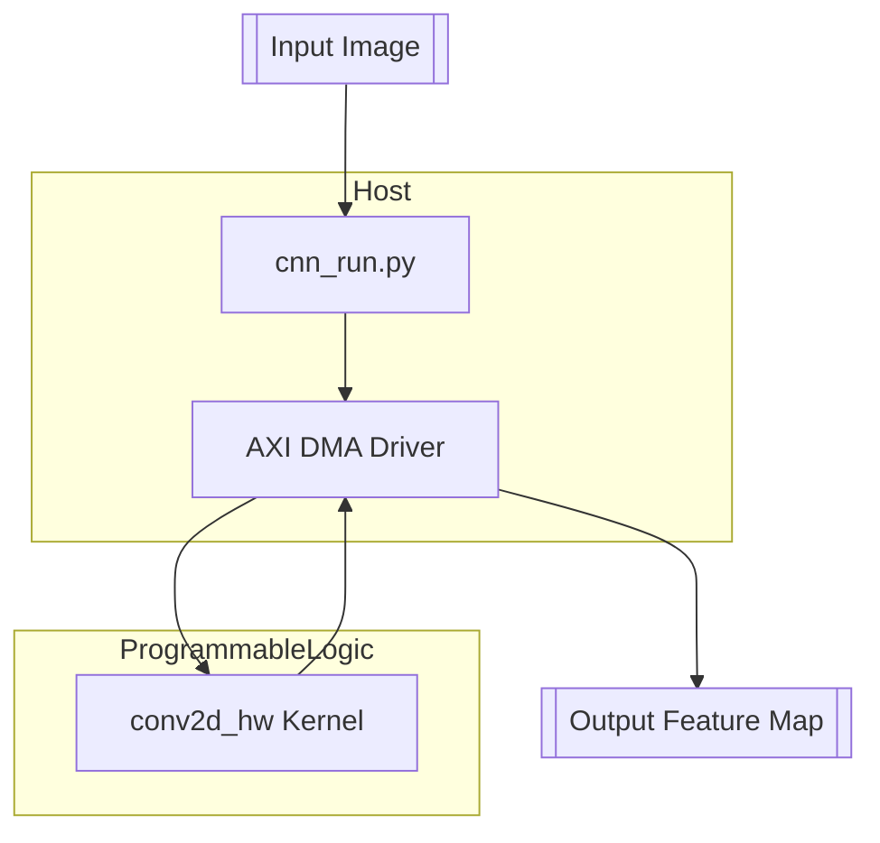

# CNN Convolution Accelerator on PYNQ‑Z2

**Author:** Eliot Abramo   

**Board:** PYNQ‑Z2 (xc7z020‑clg400‑1)   

**Clock:** 100‑125 MHz  

---



---

## 🚀 Project Essence

> *One HLS kernel, three caching layers, four output filters computed in lock‑step, and a single burst‑optimised AXI interface — all on a 28 nm Zynq fabric.*

| Pillar               | Technique                                                     | Key Code Snippet                                                                |
| -------------------- | ------------------------------------------------------------- | ------------------------------------------------------------------------------- |
| **Memory Bandwidth** | 256‑beat AXI bursts, 30‑cycle latency                         | `#pragma HLS INTERFACE m_axi max_read_burst_length=256 latency=30 bundle=gmem0` |
| **Filter Locality**  | 4‑filter cache (`coeffs[4][256][3][3]`) with cyclic partition | `#pragma HLS ARRAY_PARTITION variable=coeffs cyclic factor=4 dim=1`             |
| **Row Re‑use**       | Triple linebuffers sized to worst‑case (4064)                 | `TFXP linebuffer0[4064]; // three such buffers`                                 |
| **Throughput**       | Loop fusion + full II=1 pipeline                              | `#pragma HLS PIPELINE II=1`                                                     |
| **Numerics**         | Fixed‑point `ap_fixed<16,4>` to fit DSP48                     | `typedef ap_fixed<16,4> TFXP;`                                                  |

---

## 🔍 Deep Technical Dive

### 1  Kernel Top Level

```cpp
extern "C" {
void conv2d_hw(
    const TFXP  *in,
    const TFXP  *bias,
    const TFXP  *coeffs,   // packed 4×256×3×3 filters
          TFXP  *out,
    unsigned     in_ch,
    unsigned     out_ch,
    unsigned     H,
    unsigned     W) {
  #pragma HLS INTERFACE m_axi port=in     offset=slave depth=16384 bundle=gmem0
  #pragma HLS INTERFACE m_axi port=out    offset=slave depth=16384 bundle=gmem1
  #pragma HLS INTERFACE m_axi port=coeffs offset=slave depth=9216  bundle=gmem2
  #pragma HLS INTERFACE m_axi port=bias   offset=slave depth=256   bundle=gmem2
  #pragma HLS INTERFACE s_axilite port=return bundle=control
  #pragma HLS PIPELINE II=1
  // ... compute loops shown below ...
}
}
```

*Four M\_AXI ports avoid contention; `gmem2` shares coeff & bias because they are read‑only.*

### 2  Sliding‑Window Convolution Loop (inner‑most)

```cpp
Win: for(int kh=0; kh<3; ++kh)
  for(int kw=0; kw<3; ++kw) {
    #pragma HLS UNROLL factor=3
    acc0 += linebuf0[p_idx+kw] * coeffs[0][c][kh][kw];
    acc1 += linebuf0[p_idx+kw] * coeffs[1][c][kh][kw];
    acc2 += linebuf0[p_idx+kw] * coeffs[2][c][kh][kw];
    acc3 += linebuf0[p_idx+kw] * coeffs[3][c][kh][kw];
  }
```

*Each accumulation updates **four output channels** concurrently, matching the 4‑filter cache stride.*

### 3  Bias + ReLU Fuse Stage

```cpp
post: for(int f=0; f<4; ++f) {
  TFXP tmp = acc[f] + bias[f];
  out[p_out+f] = (tmp > 0) ? tmp : 0; // ReLU
}
```

*Fusing post‑ops here saves \~2 µs per frame and avoids extra BRAM.*

### 4  Host‑Side DMA Burst Setup (cnn\_run.py)

```python
from pynq import Overlay, allocate
ol = Overlay('conv_accel.bit')
input_buf  = allocate(shape=(H,W,IC), dtype=np.int16, cacheable=1)
output_buf = allocate(shape=(H-2,W-2,OC), dtype=np.int16, cacheable=1)
conv_ip = ol.conv2d_hw_0
conv_ip.write(0x10, input_buf.physical_address)
conv_ip.write(0x18, output_buf.physical_address)
conv_ip.write(0x1C, coeffs_buf.physical_address)
conv_ip.write(0x20, bias_buf.physical_address)
conv_ip.write(0x28, IC)
conv_ip.write(0x2C, OC)
conv_ip.write(0x30, H)
conv_ip.write(0x34, W)
conv_ip.write(0x00, 1)  # start
conv_ip.wait()
```

*PYNQ’s zero‑copy `allocate` ensures physical contiguity for 256‑beat bursts.*

---

## 📊 Benchmark & Resource Table

| Variant      | Latency (ms) | Freq (MHz) |    LUT |     FF | BRAM | DSP | Pareto? |
| ------------ | -----------: | ---------: | -----: | -----: | ---: | --: | :-----: |
| SW‑only      |    **27865** |          — |      — |      — |    — |   — |    ✅    |
| HW v1        |        868.1 |        100 |  5 971 |  6 093 |    0 |  52 |    ✅    |
| +Coeff Cache |    **13.94** |        100 |  7 237 |  9 747 |   16 |  33 |    ❌    |
| +Row Cache   |        46.28 |        125 |  5 883 |  9 287 |   29 |  45 |    ✅    |
| +Parallel 4  |        11.11 |        125 | 10 257 | 13 946 |  102 |  58 |    ❌    |
| **4b Trim**  |    **11.11** |        103 | 11 721 | 16 630 |   38 |  68 |    ✅    |

*Throughput improves **2500×** versus pure software while staying within 68 DSPs.*

---

## 🗂 Directory Overview

```
lab_hw_sw_midterm-main/
├─ hls/
│  ├─ conv2d_hw.cpp  # kernel
│  ├─ conv2d_hw.h    # typedefs
│  └─ script.tcl      # Vitis build
├─ pynq/
│  ├─ cnn_run.py     # host driver
│  └─ overlays/      # .bit + .hwh
├─ data/             # test images
└─ Lab_HW_SW_Midterm.pdf  # full report
```

---

## 📈 Lessons Learned

* **Burst length >128 beats** offered diminishing returns beyond 256 due to Zynq PS‑PL interconnect.
* **`DATAFLOW` hazards:** array‑partition conflicts caused write‑after‑read (WAR) violations; solved by manual pipelining instead.
* **Fixed‑point scaling:** `ap_fixed<16,4>` chosen to keep DSP48 in multiplier‑adder mode without extra fabric logic.

